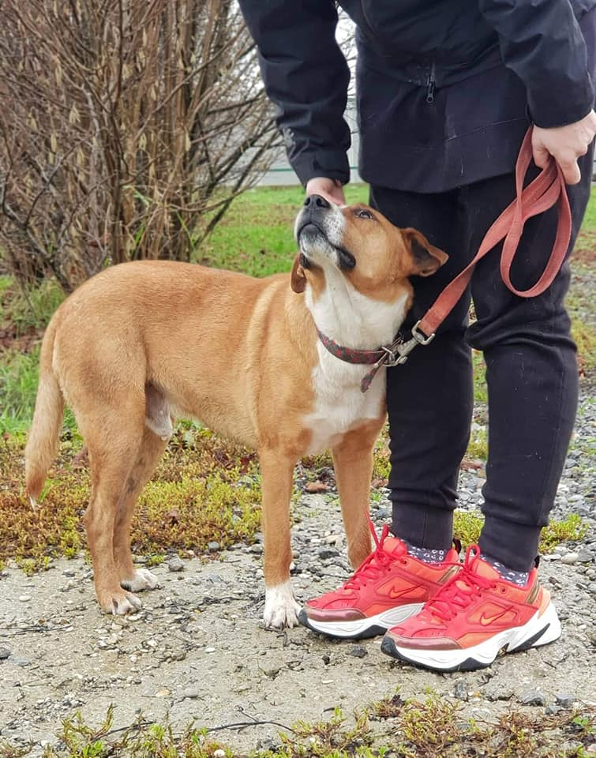

Da mozemo uzeti dio tvoje tuge da ti bude lakse uzeli bismo iste sekunde.
Ne mozemo ti tako pomoci Ponco nazalost. Mozemo samo napisati da si savrsen, da smo se zaljubili u tebe cim si nam pruzio sapicu i pognuo glavu kao da se ispricavas sto si zavrsio tu gdje jesi.
Iza tebe tuzna sjecanja, u boksu ti drustvo prave brige i strah sto nosi sutra, a ispred tebe tracak nade i predug red onih koji cekaju. Hoce li netko prepoznati koliko si dobar?

Ponco je predivan, vratio nas je kao vremeplovom u vrijeme kad je Sparky bio u tom boksu. Jednako divan, njezan, voli pse, voli ljude, voli djecicu. Ma Ponco je takva dobrota, da se tesko sabrati i napisati nesto smisleno, jer krene tuga i bijes sto je tamo. Sto uopce treba objavu umjesto da je najsretniji pas na svijetu, a ne tuzni obris prepoznatljiv izdaleka dok koracate prema boksovima i onda te dobre oci...

Ponco ima 2 godine i hitno treba dom. Ovakva dobrota i resetke...molimo vas dodjite mu i vidjet cete o kakvoj dusici se radi 💔