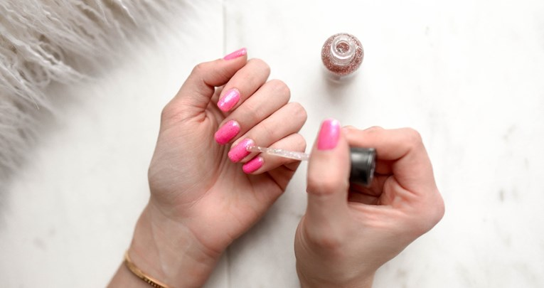

ZNATE li da postoji pravilo o tome na koji način i koliko točno trebate rezati nokte? Da. To pravilo nosi naziv "90-10" i vjerojatno nikada niste čuli za njega, a može vam osigurati lijepe i njegovane nokte.

Prema njemu, 90 posto izraslog nokta trebate odrezati, a preostalih 10 posto potrebno je skratiti i oblikovati turpijanjem.

Dok jedna skupina žena nokte skraćuje isključivo rezanjem, druge to odrađuju turpijanjem. Jasno je kako turpijanje cijelog izraslog nokta oduzima dragocjeno vrijeme, dugotrajan je proces te vaši nokti zbog toga neće biti ništa zdraviji niti ljepši. Umjesto toga, pridržavajte se spomenutog pravila i vaša manikura će biti ekspresno gotova.